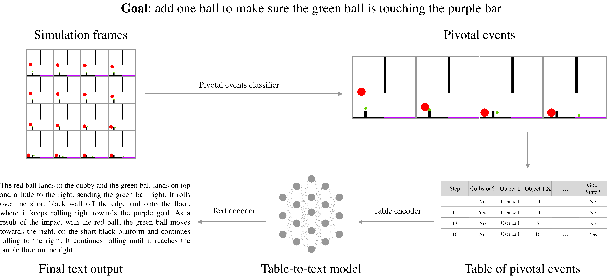

# ESPRIT
Dataset and documentation for paper on [Explaining Solutions to Physical Reasoning Tasks (ESPRIT)](https://arxiv.org/abs/2005.00730)

Figure below shows an overview of the end-to-end ESPIRT framework.



This repo provides the dataset used to produce results in our paper accepted at ACL 2020 -- ESPRIT: Explaining Solutions to Physical ReasonIng Tasks.
Our dataset extends the Physical Reasoning (PHYRE) dataset (https://phyre.ai/) to include annotations for pivotal frames as well as natural language open ended explanations for the solutions to 2D physics simulations.

We only focus on the PHYRE tasks in which the solution involves placing a single red ball and we were able to get solutions for 2441 of 2500 tasks across 25 different templates (please see our paper for more details).

The repo contains the following datasets:
- **Human annotations:** This directory includes open-ended text annotations for the initial scene and the sequence of salient events.
- **Data tables:** This directory includes data about the objects, their attributes, their position, and their velocity in csv and json formats as separate sub-directories.
- **Salient frames images:** This directory includes snapshots of the initial state and sequence of salient events. Note that we used visual data only for collecting human annotations and evaluations.

### Bibtex
If you use this dataset or paper in your work, please cite: [Explaining Solutions to Physical Reasoning Tasks (ESPRIT)](https://arxiv.org/abs/2005.00730)

```
@InProceedings{rajani2020esprit,
    title = {{ESPRIT}: {E}xplaining {S}olutions to {P}hysical {R}easoning {T}asks},
    author = {Nazneen Fatema Rajani, Rui Zhang, Yi Chern Tan, Stephan Zheng, Jeremy Weiss, Aadit Vyas, Abhijit Gupta, Caiming Xiong, Richard Socher, Dragomir Radev},
    booktitle = {Proceedings of the 2020 Conference of the Association for Computational Linguistics (ACL2020)},
    year = {2020}
    url = {https://arxiv.org/abs/2005.00730}
}
```


